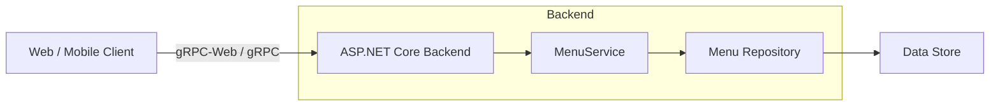

# Restaurant Order Manager — Backend

Basic ASP.NET Core gRPC backend for a restaurant ordering system. gRPC-Web is enabled for browser clients.

## High-level architecture

## Endpoints (gRPC)

Service: `menu.Menu` (see `src\RestaurantOrderManager.Backend.Proto\Proto\menu.proto`)

- `GetMenu(GetMenuRequest) returns (GetMenuResponse)` — currently implemented.
  - Returns a list of `MenuItem` and a server `Timestamp`.
- `PlaceOrder(PlaceOrderRequest) returns (PlaceOrderResponse)` — defined in proto (not yet implemented).
- `GetOrderStatus(GetOrderStatusRequest) returns (GetOrderStatusResponse)` — defined in proto (not yet implemented).
- `GetLiveOrdersForTable(GetLiveOrdersForTableRequest) returns (GetLiveOrdersForTableResponse)` — defined in proto (not yet implemented).

Transport notes:
- gRPC-Web is enabled, and a permissive CORS policy is configured for development.
- Default dev URLs (from `launchSettings.json`): `http://localhost:5134`, `https://localhost:7088`.
- A plain GET to `/` returns a help message indicating gRPC usage.